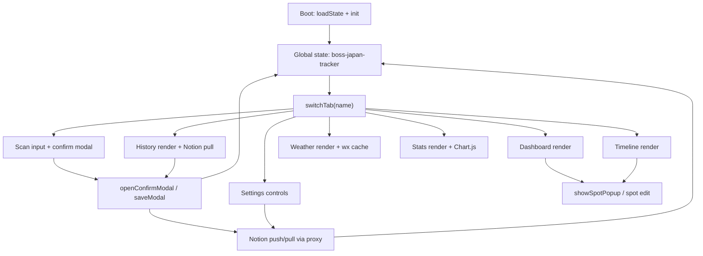

# travel-expense — Per-Tab Technical Documentation

This folder contains a technical reference for each of the 7 tabs in `index.html`. The app is a single-file HTML PWA (~10,200 lines, vanilla JS + Tailwind CDN + Chart.js) — there is no build step, no bundler, no framework, and no separate JS modules. Everything lives in one file.

> Note: this project is **not** part of the WAT (Workflows / Agents / Tools) framework that appears in the global `~/CLAUDE.md`. WAT applies to Oscar-agent-style multi-tool agents. This is a vanilla browser PWA — keep that mental model.

## Per-tab files

| Tab | File | DOM section | Line in `index.html` |
|---|---|---|---|
| Dashboard | [dashboard.md](./dashboard.md) | `#tab-dashboard` | 397 |
| Scan | [scan.md](./scan.md) | `#tab-scan` | 492 |
| History | [history.md](./history.md) | `#tab-history` | 573 |
| Weather | [weather.md](./weather.md) | `#tab-weather` | 593 |
| Stats | [stats.md](./stats.md) | `#tab-stats` | 607 |
| Timeline | [timeline.md](./timeline.md) | `#tab-timeline` | 660 |
| Settings | [settings.md](./settings.md) | `#tab-settings` | 675 |

The bottom navigation tab bar is at lines 1098–1130.

## React public app notes

The primary public UI is now the React app under `app-react/`, deployed at `/react/` on GitHub Pages and at the Vercel root. The legacy tab docs in this folder still describe `index.html`; when React behavior differs, the tab file should call that out explicitly. As of 2026-05-30, `timeline.md` includes the React Itinerary rail behavior: compact header, single date display, Magic UI rail beam, spot-index progress, and dimmed-but-coloured rails outside the trip date window.

## Shared concepts referenced from tab docs

### State model
Single global `state` object (line 1747) persisted to `localStorage` under key `boss-japan-tracker`. Hydrated by `loadState()` (line 1796) at boot, written by `saveState()` (line 1896) on every mutation. Notable fields:

- `state.receipts[]` — all receipts (schema documented in CLAUDE.md)
- `state.budget` (JPY), `state.rate` (HKD per 100 JPY), `state.tripCurrency`
- `state.persons[]`, `state.shareRatios{}` — split-bill setup
- `state.scanModel` / `state.voiceModel` / `state.emailModel` — selected LLM per use-case
- Legacy root app still has local key fields, but React `/react/` uses `state.credentialBrokerUrl`, `state.credentialSession`, and broker-routed Kimi/Google/Notion calls instead of browser-held provider keys.
- `state.notionDb`, `state.proxy` (legacy proxy URL), `state.autoSync`
- `state.top10IncludeBigItems`, `state.statsIncludeTransportLodging` — UI toggles (Stats tab)
- `state.customItinerary` — overrides the built-in `ITINERARY` constant when non-null
- `state.lastTab` — restored on next load

### Constants worth knowing
- `CATEGORIES` — line 1567 (9 entries: flight / transport / food / shopping / lodging / ticket / localtour / medicine / other)
- `PRE_PAID_CATEGORIES` — line 1580 (set used by `getReceiptPhase` to classify "prep" vs in-trip spending)
- `PAYMENTS` — line 1581 (cash / credit / paypay / suica)
- `PERSON_EMOJIS` — line 1587
- `SCAN_MODELS` — line 1588 (vision-capable LLMs for receipts)
- `VOICE_MODELS` — line 1598 (text models for Cantonese voice parsing)
- `EMAIL_MODELS` — line 1616 (text models for email-import parsing)
- `ITINERARY` — line 1630 (built-in 6-day Nagoya itinerary)
- Deprecated React providers such as MiniMax, GLM/ZAI, and OpenRouter are not shown in the new React model picker.
- `APPS_SCRIPT_URL` — raw GitHub copy of `email-to-notion.gs`, used by the in-app Apps Script helper/editor only; email import itself is Gmail → Apps Script → Notion → app pull.

### Global helpers (used by every tab)

| Helper | Line | Purpose |
|---|---|---|
| `$(id)` | 1960 | `document.getElementById` shortcut |
| `fmt(n)` | 1961 | thousands-separator number format |
| `escapeHtml(s)` | 3695 | XSS-safe text → HTML |
| `toast(msg, type)` | 2077 | bottom-of-screen status toast |
| `loadState()` | 1796 | hydrate `state` from localStorage |
| `saveState()` | 1896 | persist `state` to localStorage |
| `switchTab(name, opts)` | 8730 | tab nav controller (animations + per-tab render dispatch + autosync trigger) |
| `autoFitTab(name)` | ~8845 | CSS `zoom` auto-shrink so tab content fits viewport |
| `notionFetch(path, opts)` | 7085 | proxied Notion API call |
| `notionPushReceipt(r)` | 7139 | upsert one receipt to Notion |
| `notionPushAll()` | 7309 | bulk push |
| `notionPullAll(silent)` | 7531 | bulk pull |
| `notionPushSettingsIfReady()` | 7492 | debounced settings sync |
| `unlockVault(password)` | 1736 | AES-256-GCM decrypt of bundled API keys |

### LLM call routers
- `callGemini(base64, mime)` — hub for receipt scanning; routes to MiniMax / GLM-4.6V / Gemini family with automatic fallback chain (referenced from `scanReceipt` line 4384).
- `callMiniMax*`, `callGLM*` — per-provider helpers near line 5500–6200.
- Gemini key rotation: `getGeminiKeys(userKey)` — tries user/vault key first, then any configured backup constants. Public source ships those defaults empty.

### Sync architecture
- Legacy Notion REST calls use `state.proxy`; React `/react/` sends Notion requests to the Credential Broker, which injects the Notion token server-side.
- Notion DB schema is enforced by `notionEnsureSchema()` (line 6876); `buildNotionProps(r, schemaMap)` (line 6938) maps a receipt onto Notion property payloads.
- `state.autoSync` toggles per-mutation push.
- Email-import path is async via Gmail label + Apps Script (`email-to-notion.gs`) → Notion → app pulls on Settings's "📬 即時同步" or History tab open.

### Security model
- The repo is public. Never commit real API keys, OAuth tokens, Notion tokens, or generated `_site/index.html` with injected secrets.
- `secrets.local.js` is gitignored and is the only supported plaintext local-dev override.
- GitHub Pages HTML is public too. Do not inject Kimi keys into the Pages artifact; Kimi keys must come from `secrets.local.js` or the Settings UI on the user's device.
- `cleanSecretValue()` treats unreplaced placeholders such as `__MINIMAX_KEY__` as empty, so a public checkout does not report fake keys as usable.
- React `saveState()` strips old provider key fields and broker sessions before writing the shared `boss-japan-tracker` snapshot.

### Tab order
Defined by `TAB_ORDER` (search for it in source — used by `switchTab` to compute slide direction). Bottom nav order is: dashboard, scan, timeline, history, weather, stats, settings.

### Build version
The visible string `APP BUILD v47` near line 1093 is the cache-bust marker. Bump it whenever you ship a deploy that needs to override a stale PWA install.

## Cross-tab function map

| User action | Entry function | Main side effects |
|---|---|---|
| Switch tabs | `switchTab(name, opts)` | Updates `_currentTab`, `state.lastTab`, tab button state, calls per-tab render, optionally pulls Notion on History |
| Save a receipt | `saveModal()` | Normalizes modal fields, updates/inserts `state.receipts`, compresses photo, calls `notionPushReceipt` if auto-sync |
| Edit a receipt | `editReceipt(id)` → `openConfirmModal` | Loads receipt into modal; save path rewrites matching `state.receipts[]` item |
| Confirm pending email item | `confirmPendingReceipt(id)` | Strips `⏳ ` prefix, saves, pushes Notion if configured |
| Push/pull all Notion data | `notionPushAll()` / `notionPullAll()` | Bulk syncs receipts plus meta settings row; pull also applies remote settings |
| Push settings | `notionPushSettings()` / `notionPushSettingsIfReady()` | Writes budget, rate, persons, split ratios, model choices, toggles, itinerary overrides to `__meta_settings__` |
| Import custom itinerary | Settings import handler → `validateItinerary` | Replaces `state.customItinerary`, sets `window.CURRENT_ITINERARY`, re-renders dependent tabs |
| Open spot popup | `showSpotPopup(opts)` | Fills generic `#hotelPopup`, prepares Maps link/edit action, blocks ghost tab switches on close |
| Open Maps | `openMapsFromPopup()` / `_openExternalUrl()` | Android intent, iOS Apple Maps, desktop Google Maps web fallback |
| Check app update | `checkForNewBuild()` | Fetches deployed root HTML, compares `APP_BUILD`, shows update bar |

## Runtime architecture map

The legacy app is best understood as a small client-side state machine wrapped in seven tab renderers. `index.html` owns the whole runtime: static DOM sections, global constants, global `state`, render functions, modal functions, and provider/sync helpers. The tab docs below describe each tab, but these are the cross-cutting layers every tab depends on:

### Core dependency contracts

| Contract | Owner | Consumers | Why it matters |
|---|---|---|---|
| `state.receipts[]` schema | Scan confirm modal + Notion pull | Dashboard, History, Stats, Timeline spot overlays, CSV export | A receipt field rename breaks almost every tab. Preserve `id`, `date`, `store`, `total`, `category`, `payment`, `SourceID`/`id`, split fields, and Notion ids. |
| `boss-japan-tracker` storage key | `loadState()` / `saveState()` | Legacy app, `app/`, `app3/` | React renovations share this key. Any migration needs a versioned adapter, not a direct rename. |
| `ITINERARY` / `state.customItinerary` | Settings import/reset | Dashboard, Timeline, Weather, budget/day logic | It controls schedule display, day labels, region lookup, and phase behavior. |
| `state.statsIncludeTransportLodging` | Settings toggle | Dashboard + Stats | One flag intentionally flips two defaults: total spend vs daily spend. |
| `state.persons[]` + `state.shareRatios{}` | Settings | Dashboard person breakdown, Stats settlement, confirm modal split controls | Split-bill math is centralized in `computeSettlements`; UI must not reimplement it differently. |
| Notion meta row `SourceID=__meta_settings__` | Settings sync | All tabs after pull | Carries non-secret settings between devices. Credentials stay local/vault-only. |
| Pending email prefix `⏳ ` | Apps Script / Notion pull | Dashboard banner, History confirmation | Prefix is both user-visible status and lightweight workflow state. |

### Render and mutation model

- Read-only tabs: Dashboard, History, Timeline, Weather, Stats mostly rebuild their DOM from `state`.
- Mutation surfaces: Scan, Settings, and shared modals (`openConfirmModal`, itinerary edit, spot popup actions).
- Persistence: every accepted mutation calls `saveState()`. Cloud sync is extra and best-effort.
- Refresh strategy: `refresh()` updates header + visible tabs, while `switchTab()` triggers tab-specific expensive work such as `renderWeather()` or Notion pull.
- Security boundary: local/vault/API-key state must not become static public HTML. Public GitHub Pages should work with empty placeholders.

### Where to look when changing behavior

| Goal | Start here | Then inspect |
|---|---|---|
| Change receipt fields | `openConfirmModal`, `saveModal`, `buildNotionProps` | `receiptCard`, `renderStats`, `computeSettlements`, CSV export |
| Change tab navigation | `TAB_ORDER`, `switchTab`, bottom nav markup | `autoFitTab`, popup ghost-click guard |
| Change itinerary display | `getItinerary`, `getEffectiveSpots`, `getScheduleSpots` | Dashboard, Timeline, Weather docs |
| Change Notion sync | `notionEnsureSchema`, `notionPushReceipt`, `notionPullAll`, `notionPushSettings` | History auto-pull, Settings buttons |
| Change AI/provider routing | `callGemini`, `callAnyTextModel`, model constants | Scan docs, Settings model cards |
