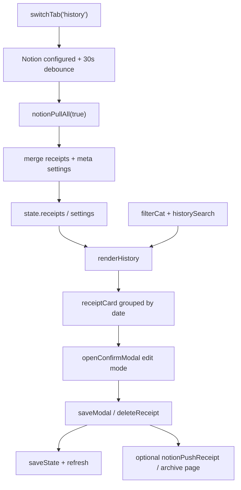

# History Tab

DOM section: `#tab-history` (line 573). Render fn: `renderHistory()` (line 3699).

## 1. Introduction

The audit + edit surface. Lists every receipt grouped by date, newest first, with a category filter and a free-text search box across store / note / itemsText / region. This is where Boss reviews entries — confirms `⏳ ` pending email-imports, fixes typos, deletes mistakes, and re-checks splits. Companion 欣欣's items are displayed alongside Tony's; the per-receipt card shows the payer's emoji + 👫/🔒/🎁 split badge.

## 2. How to Use

- **Search** — type into `#historySearch`. Filters across store, note, itemsText, region (lowercased substring).
- **Filter category** — `#filterCat` dropdown.
- **Tap a card** — opens confirm modal in edit mode (`openConfirmModal(r, ...)`); change any field, save → updates `state.receipts` + Notion-syncs if enabled.
- **Confirm a pending entry** — yellow card with `⏳ ` prefix on store name; same tap-to-edit but the prefix gets stripped on save.
- **Delete** — inside the confirm modal.
- **Live sync badge** (`#historySyncBadge`) — appears top-right when a Notion pull is in flight.

Legacy pulls from Notion on tab switch when its local Notion config exists. React `/react/` pulls only through the Credential Broker, so provider tokens are never stored in the browser.

## 3. UI Anatomy

| Element | ID | Purpose |
|---|---|---|
| Heading row | — | Title + sync badge (line 574) |
| Sync badge | `#historySyncBadge` | "☁️ 同步中…" / "✅ 已同步" / "⚠️ 同步失敗" (line 577) |
| Category filter | `#filterCat` | Populated from `CATEGORIES` (line 579) |
| Search input | `#historySearch` | Free-text filter (line 585) |
| Group list | `#historyList` | Date-grouped cards (line 587) |

Each date group renders:

```
<div class="mb-4">
  <div>2026-04-23  ¥7,650</div>
  <div>{receiptCard(r) × n}</div>
</div>
```

`receiptCard(r)` is the shared receipt-display helper (search `function receiptCard`); same component used on Dashboard's today list and inside spot popups.

## 4. Functions & Logic

| Function | Line | Role |
|---|---|---|
| `renderHistory()` | 3699 | Filter + search + group-by-date + render |
| `receiptCard(r)` | search source | Shared receipt-card builder |
| `escapeHtml(s)` | 3695 | XSS-safe text render |
| `_staggerCards(list)` | search source | Fade-in stagger |
| `_reInitAnimations()` | search source | Re-arms IntersectionObservers |
| `notionPullAll(silent)` | 7531 | Pulls entire DB into `state.receipts` |
| `openConfirmModal(r, base64, warnings)` | search source | Edit modal (also used by Scan) |
| `isPendingReceipt(r)` | 2864 | True if store starts with `⏳ ` |
| `displayStore(r)` | 2867 | Strips `⏳ ` for display |

Filter pipeline (lines 3700–3709): `state.receipts.slice().reverse() → filter by category → filter by lowercased search across multiple fields → group by date`. No pagination; assumes receipt count stays small (< 1000). Sort within group is preserved insertion order.

## 5. Button → Function Map

| Trigger | Selector | Handler | Effect |
|---|---|---|---|
| Search input | `#historySearch` | `input` event listener (in `init()`) | Re-renders |
| Category filter | `#filterCat` | `change` listener | Re-renders |
| Receipt card tap | `receiptCard(r)` inline `onclick` | `openConfirmModal(r, ...)` | Edit modal |
| Sync badge | `#historySyncBadge` | — (read-only) | — |

History has no save/cancel buttons of its own — it's a viewer. Mutations route through the confirm modal.

## 6. LLM Models Used

**None — pure DOM rendering.** Edit modal can re-OCR (uses `callGemini`) but that's the modal, not History itself. The tab consumes already-saved `state.receipts`.

## 7. State Fields Touched

Read:

- `state.receipts[]` (filtered, grouped)
- DOM-only: `#filterCat.value`, `#historySearch.value`

Written: nothing directly. The confirm modal (opened by tap) writes back.

## 8. Sync Behavior

- **Pull on tab switch** (line 8806): if Notion is configured and last pull was > 30 s ago, runs `notionPullAll(true)` and re-renders. The `#historySyncBadge` flashes through 同步中 → 已同步 → fade out (2 s).
- **Push** when a card is edited and saved → confirm modal calls `notionPushReceipt(r)` if `state.autoSync`.
- **Email-import discovery** — Apps Script writes new `⏳ `-prefixed entries directly to Notion; History's pull surfaces them on next tab switch.
- The 30 s debounce (`_lastNotionPull` global) prevents Boss from hammering Notion if he taps History repeatedly.

## 9. Configuration & Customization

User-tunable in Settings affecting this tab:

- Notion token / DB ID / proxy → enables the auto-pull behavior
- `state.autoSync` → controls whether edits push back

Internal constants:

- `CATEGORIES` (line 1567) — populates `#filterCat` and the per-card emoji
- `PAYMENTS` (line 1581) — used by `receiptCard` for the payment chip

## 10. Edge Cases & Known Limitations

- **Empty state** — `<p>未有任何紀錄</p>` (line 3712).
- **Search with diacritics / Japanese case** — substring match is `.toLowerCase()`; works for Latin and ASCII; Japanese kana/kanji match by code-point identity. Searching for "ローソン" matches; "lawson" does not match `ローソン`.
- **No filter combination memory** — filter + search reset on next page load (only their `<input>` value is in DOM).
- **Notion 401 / 4xx** — `notionPullAll` toasts the error and the badge flips to ⚠️; no auto-retry.
- **Concurrent edits** — last-write-wins. If two devices edit the same receipt before sync, the later push overwrites.
- **Pending receipts without Notion configured** — the user has no `notionPullAll` source, so `⏳ ` items never appear. Mitigated by Apps Script being explicitly opt-in.

## 11. Technical Notes

- **30 s debounce on Notion pull** — `_lastNotionPull` is a module-level number (timestamp). Only the History tab triggers; Dashboard does not pull (it consumes whatever History last hydrated).
- **Sync badge UX** — three states (`同步中…` blue, `✅ 已同步` green fade, `⚠️ 同步失敗` red) — the green state auto-hides after 2 s; failure auto-hides after 3 s.
- **`receiptCard` reuse** — same builder runs on Dashboard, History, day-receipts modal, spot popups. Any visual change to receipt presentation lives there.
- **No virtualization** — full DOM render every keystroke. Fine for hundreds of receipts; would matter at 10 k+.
- **`refreshSettingsInputsFromState()`** is fired after a successful pull (line 8816) — this is what propagates Notion-pulled `budget` / `rate` / `tripDateRange` updates to the Settings inputs without a manual refresh.

## 12. Detailed Function Responsibilities

| Function / helper | What it owns | Inputs | Outputs / side effects |
|---|---|---|---|
| `renderHistory()` | History list render | `state.receipts`, `#filterCat`, `#historySearch` | Filters, groups by date, writes `#historyList`, re-arms animations |
| `receiptCard(r)` | Shared receipt row/card UI | Receipt object | Returns HTML with amount, payer, split badge, pending/confirm/photo controls |
| `displayStore(r)` | Store label cleanup | Receipt store | Strips `⏳ ` for display while preserving pending state in data |
| `isPendingReceipt(r)` | Pending detector | Receipt store/source fields | Drives yellow cards, pending banner, confirm button |
| `confirmPendingReceipt(id)` | One-tap email confirm | Receipt id | Removes pending prefix, saves, pushes Notion if configured |
| `editReceipt(id)` | Edit entry | Receipt id from card | Opens shared confirm modal with existing values |
| `openConfirmModal(r, photo, warnings)` | Edit modal | Existing receipt | Save path rewrites matching receipt and may sync Notion |
| `notionPullAll(silent)` | Cloud refresh | Notion token/DB/proxy | Replaces/merges local receipts, applies meta settings, updates deletion guards |
| `notionPushReceipt(r)` | Cloud write after edit | Edited receipt | Upserts page; preserves `notionPageId`; handles missing page recreation |
| `notionDeletedIds` handling | Delete resurrection guard | Deleted page ids | Prevents archived/deleted Notion records from reappearing on pull |

### Search/filter details

- Search covers `store`, `note`, `itemsText`, and `region` via lowercased substring matching.
- Category filter uses `CATEGORIES`; `all` means no category predicate.
- Date grouping is descending because `state.receipts.slice().reverse()` starts from newest local insertion order.

## 13. Architecture & Logic Deep Dive

History is the app's audit log and cloud-refresh gateway. The render function itself is simple, but the tab is architecturally important because `switchTab('history')` is the only automatic Notion pull path in normal navigation.

### Data flow



### Responsibilities split

| Concern | Owned by | Notes |
|---|---|---|
| List filtering | `renderHistory()` | Pure in-memory filter/search/group; no cloud calls inside the function |
| Fresh cloud data | `switchTab()` wrapper around History | 30 s debounce avoids repeated Notion API hits |
| Row UI | `receiptCard(r)` | Shared with Dashboard and day-receipt modal, so card changes are cross-tab changes |
| Edit/save | Confirm modal + `saveModal()` | History is not a form; it opens the shared receipt editor |
| Delete | `deleteReceipt()` | Tracks Notion page ids and email `SourceID`s to avoid resurrection |
| Settings refresh | `refreshSettingsInputsFromState()` after pull | Pull can update budget/rate/person/model settings through meta row |

### Pending email lifecycle

1. Gmail label + Apps Script parse an email and write a Notion row.
2. Pending records use `store` prefix `⏳ `.
3. History pull hydrates them into `state.receipts`.
4. Dashboard shows the pending banner; History shows pending cards.
5. User opens the card, reviews fields, saves; the pending prefix is removed.
6. `notionPushReceipt` persists the confirmed state when auto-sync is configured.

### Consistency risks

- Last-write-wins is intentional but risky: two devices can edit the same receipt between pulls.
- Search/filter output is derived from local state only. If Notion pull fails, History still shows stale local data.
- Deletion is two-stage: local removal is immediate; Notion archive is best-effort. The resurrection guard is what keeps a failed archive from reappearing on next pull.
- `receiptCard` must escape user-facing strings because model output and email text can contain arbitrary characters.

### Debug checklist

1. New email import missing: check Notion token/DB/proxy, then force History tab pull or Settings "即時同步".
2. Deleted email import came back: inspect `state.notionDeletedSourceIds` and whether the row has the same `SourceID`.
3. Edited receipt did not sync: check `state.autoSync`, `notionPageId`, and the `notionPushReceipt` error toast.
4. Settings changed after opening History: expected if Notion meta row was newer; verify `__meta_settings__`.
5. Slow typing in search: full DOM render happens on every input; virtualization would be needed only at very high receipt counts.
