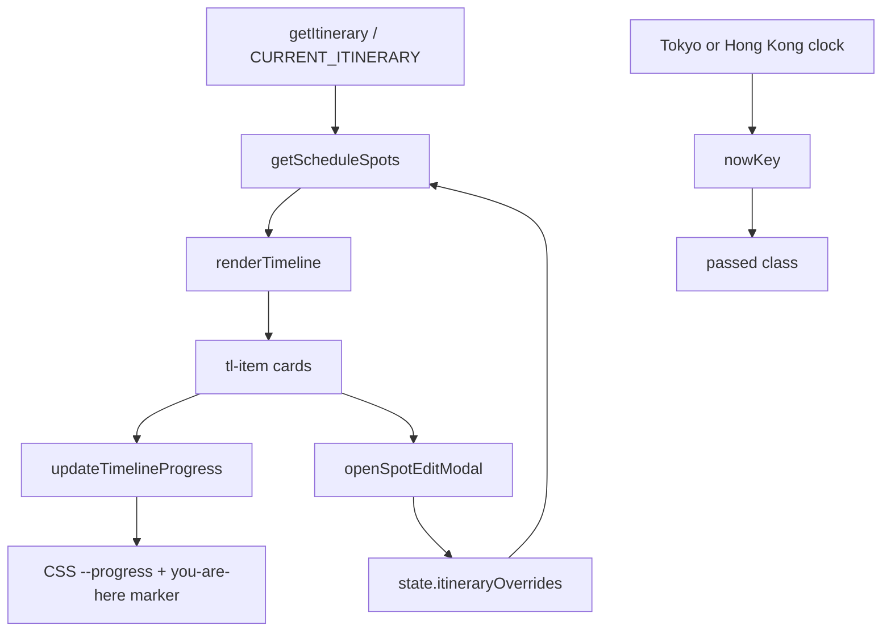

# Timeline Tab

DOM section: `#tab-timeline` (line 660). Render fn: `renderTimeline()` (line 3741).

## 1. Introduction

A metro-station-style schedule view of the trip. Every itinerary day's spots are laid out vertically with a "you are here" progress dot that advances through the schedule based on Asia/Hong-Kong wall-clock time. Items in the past are styled `.passed` (filled dot, faded card); items in the future are open circles. Built so Boss can glance at the tab and see "next stop in 30 minutes is 兼六園" without reading anything.

Unlike Dashboard's itinerary card, Timeline shows pure schedule — no expense overlay. For receipt overlay see Dashboard's day cards or History.

## 2. How to Use

- **Open the tab** — schedule renders top-down, day by day.
- **Tap a card** — if the spot has a `_spotIdx` (i.e., it's editable), opens `openSpotEditModal(date, idx)` to change time/name/note.
- **Watch the progress dot** — auto-ticks every 5 minutes (line 3822) when the tab is visible.
- **Resize the window** — the progress bar recomputes after a 150 ms debounce (line 3812).

No filters, no toggles. The tab is "informational dashboard."

## 3. UI Anatomy

| Element | ID / class | Purpose |
|---|---|---|
| Heading | — | "旅程時間軸 🗾" + 計劃 + 實際 hint (line 661) |
| Legend | — | Two dots: 計劃中 (open) / 實際消費 (filled) (line 666) |
| Container | `#timelineList` | All day-headers + items rendered here (line 671) |
| Day header | `.tl-day-header` | One per ITINERARY day; "今日 📍" suffix on the active day |
| Spot card | `.tl-item.planned` | Per-spot card; `data-side="left|right"` for zigzag |
| Passed marker | `.passed` class | Spots before `nowKey` |
| You-are-here dot | `.tl-you-are-here` | Inserted dynamically (line 3806) |
| Time row | `.tl-time` | HH:MM + optional timezone badge |
| Name row | `.tl-name` | Category icon + name + override badge |
| Note row | `.tl-note` | First 120 chars of `spot.note` |

Override badge: `✏️ 已更新` indicates the user has edited that spot via `_setItineraryOverride`.

CSS lives at module top — `.timeline`, `.tl-item`, etc. — uses CSS variables `--progress` (set in JS) to draw the metro line.

## 4. Functions & Logic

| Function | Line | Role |
|---|---|---|
| `renderTimeline()` | 3741 | Builds the entire DOM from `ITINERARY` |
| `updateTimelineProgress()` | 3788 | Computes `--progress` pixel offset and inserts the "you are here" marker |
| `_tlKey(dateYMD, hhmm)` | 3737 | Sortable key — used to compare against `nowKey` |
| `getScheduleSpots(day)` | search source | Returns the day's spots with overrides applied (no expense rows mixed in) |
| `_getItineraryOverride(date, idx)` | 2873 | User-edited spot fields |
| `openSpotEditModal(date, idx)` | search source | Edit modal (also used by Dashboard's itinerary popup) |
| `setInterval(...)` | 3822 | Re-renders every 5 min while tab visible — `if (document.hidden) return; if (!tab-timeline.hidden) renderTimeline()` |
| `window.addEventListener('resize', ...)` | 3813 | 150 ms debounce → `updateTimelineProgress()` |

`nowKey` derivation (inside `renderTimeline`): uses the same trip-aware date decision as `todayForReceipts()`. During the Japan trip window it formats Asia/Tokyo time; outside the trip it falls back to Asia/Hong-Kong. The result is a sortable `YYYY-MM-DD HH:MM` string compared against `_tlKey(date, time)`.

## 5. Button → Function Map

| Trigger | Selector | Handler | Effect |
|---|---|---|---|
| Spot card tap (editable) | `.tl-item` with inline `onclick="openSpotEditModal(...)"` | `openSpotEditModal` | Opens edit modal |
| Spot card tap (non-editable) | — | none | No-op |
| Window resize | — | `_tlResizeTimer` debounce | `updateTimelineProgress()` |
| Auto-tick | — | 5-min `setInterval` | Re-renders if visible |

## 6. LLM Models Used

**None — pure DOM rendering + CSS.** No HTTP, no AI.

## 7. State Fields Touched

Read:

- `state.customItinerary` (via `window.CURRENT_ITINERARY || ITINERARY`)
- `state.itineraryOverrides` (via `getScheduleSpots → _getItineraryOverride`)

Written: nothing. Edits route through `openSpotEditModal` → `_setItineraryOverride` (line 2876) which writes to `state.itineraryOverrides`.

## 8. Sync Behavior

- No direct Notion push from this tab.
- Itinerary overrides (`state.itineraryOverrides`) sync via `notionPushSettingsIfReady` from inside the edit modal.
- Pulls happen via the global `notionPullAll` path triggered from History; Timeline picks up changes on the next render.

## 9. Configuration & Customization

User-tunable in Settings:

- 🗾 行程設定 / 匯入 → swaps in `state.customItinerary`
- Each spot is editable via tap → modal → name / time / address / note

Internal constants:

- `ITINERARY` — line 1630
- `CATEGORIES` — line 1567 (icons used in `tl-name`)

## 10. Edge Cases & Known Limitations

- **No spots in a day** — day header renders with no items.
- **Pre-trip** — every spot is in the future; `passed.length === 0` → progress bar stays at 0; no "you are here" marker inserted (line 3796).
- **Post-trip** — every spot is `.passed`; "you are here" sits at the bottom.
- **Window resize during tab-hidden** — `_tlResizeTimer` fires but `updateTimelineProgress` skips if the section is hidden (line 3815).
- **No real-time receipt overlay** — Timeline does not show consumption events. (Could be added by interleaving `state.receipts` items between schedule items, but the current view is intentionally schedule-only — that's what the legend's "計劃中 / 實際消費" anticipates is for *future* expansion, not current behavior.)
- **5-minute tick + active tab assumption** — works in browser; PWA in iOS background may pause `setInterval` until foregrounded. The first foreground tick catches up.

## 11. Technical Notes

- **Metro-station progress bar via CSS variable** — `container.style.setProperty('--progress', '${px}px')`. CSS uses `--progress` to size a vertical gradient/line. Single source of truth, no per-item DOM math.
- **`_tlKey` sort safety** — when a spot has no `time`, falls back to `'99:99'` so it sorts to the end of the day. Won't be marked passed prematurely.
- **Trip-aware `nowKey`** — Timeline now mirrors Dashboard's trip-aware date logic: Japan trip days use `Asia/Tokyo`, outside-trip dates use `Asia/Hong_Kong`. This avoids the old 1-hour mismatch where Dashboard and Timeline could disagree around JST midnight.
- **`document.hidden` check** in the `setInterval` (line 3823) saves battery — a Page-Visibility–API-aware tick prevents background re-renders.
- **Animation tip** — when `_currentTab === 'timeline'`, the `setInterval` re-runs `renderTimeline()` not `updateTimelineProgress()` — full DOM rebuild every 5 min. Cheap given small DOM size, but `updateTimelineProgress()` alone would suffice if `time` and overrides haven't changed.

## 12. Detailed Function Responsibilities

| Function / helper | What it owns | Inputs | Outputs / side effects |
|---|---|---|---|
| `renderTimeline()` | Full metro-style schedule DOM | `getItinerary()`, current HKT/Tokyo clock, overrides | Rebuilds `#timelineList`, marks passed/future spots, schedules progress update |
| `_tlKey(date, hhmm)` | Sortable schedule comparison key | Date + time | Returns `YYYY-MM-DD HH:MM`; missing time sorts to end |
| `getScheduleSpots(day)` | Pure schedule spots | Itinerary day + overrides | Returns planned spots only; no receipt overlays |
| `_getItineraryOverride(date, idx)` | Override lookup | Day date and spot index | Returns saved patch from `state.itineraryOverrides` |
| `openSpotEditModal(date, idx)` / `openSpotEdit()` | Edit entry | Date/index from timeline card | Opens shared spot edit modal |
| `saveSpotEdit()` | Commit itinerary edit | Modal fields | Writes override via `_setItineraryOverride`, saves local state, syncs settings meta row if ready |
| `resetSpotEdit()` | Restore built-in value | Current modal target | Deletes override for that spot, re-renders timeline/dashboard |
| `updateTimelineProgress()` | Progress line/dot placement | Rendered `.tl-item` geometry + clock | Sets CSS `--progress`; inserts/moves `tl-you-are-here` marker |
| Resize listener | Layout maintenance | Window resize | Debounced progress recalculation; canceled when leaving Timeline |
| 5-minute interval | Clock maintenance | Page visibility and current tab | Re-renders when Timeline is visible and app is foregrounded |

Timeline is deliberately schedule-only. Actual spend overlays live on Dashboard and History, so this tab stays useful even before Notion/receipts are configured.

## 13. Architecture & Logic Deep Dive

Timeline is a pure schedule projection. Its main job is temporal orientation, not expense reporting, so it deliberately avoids `state.receipts[]` overlays even though Dashboard uses them heavily.

### Data flow

### Why there are two itinerary helpers

| Helper | Used by | Includes receipt overlays? | Purpose |
|---|---|---:|---|
| `getEffectiveSpots(day)` | Dashboard | Yes: lodging/transport receipts can replace or insert spots | Mixed itinerary + actual spend context |
| `getScheduleSpots(day)` | Timeline | No | Stable planned schedule view with user edits only |

Keeping these separate prevents a scanned hotel receipt or flight ticket from unexpectedly reshaping the metro timeline. If future design wants "actual spend events" in Timeline, add it as a separate layer, not by switching to `getEffectiveSpots()`.

### Rendering model

- `renderTimeline()` rebuilds the full list from itinerary data.
- `_tlKey(date, time)` converts each spot into a sortable key; missing times become `99:99`.
- Passed state is computed by string comparison against `nowKey`.
- `updateTimelineProgress()` measures rendered DOM geometry and sets one CSS variable instead of updating every line segment.
- Resize and the 5-minute interval are maintenance paths, not data mutation paths.

### Cross-tab contracts

- Settings owns itinerary import/export and spot edits.
- Dashboard owns receipt-overlaid day cards.
- Weather consumes itinerary regions/spots for coordinate lookup, but does not share Timeline's progress logic.
- History/Scan receipt changes should not affect Timeline unless they also update itinerary overrides.

### Debug checklist

1. Wrong item marked passed: inspect `todayForReceipts()`, trip date range, timezone branch, and `_tlKey` output.
2. Progress marker misplaced: call `updateTimelineProgress()` after layout/resize; check hidden tab measurement.
3. Edited spot not visible: inspect `_getItineraryOverride(date, idx)` and whether the spot has a stable `_spotIdx`.
4. Receipts missing from Timeline: expected by design; check Dashboard instead.
5. Battery/performance issue: replace the 5-minute full re-render with `updateTimelineProgress()` if itinerary data is unchanged.
