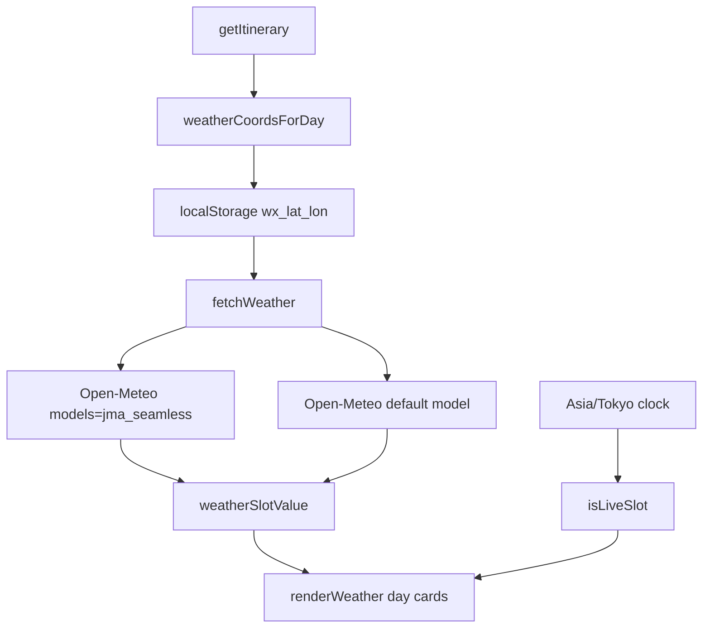

# Weather Tab

DOM section: `#tab-weather` (line 593). Render fn: `renderWeather()` (search source; currently near the weather section after Notion/delete helpers).

## 1. Introduction

Per-day forecast for the trip itinerary. Each day card lists every spot's region with a 5-slot strip (09 / 12 / 15 / 18 / 21 JST) showing temperature, weather icon, and rain probability. The current Asia/Tokyo wall-clock hour is highlighted with a red ●LIVE badge. Built primarily for Boss to decide whether to bring an umbrella before he leaves the hotel — not for forecast addicts. There is no companion-specific data; weather is per-location.

Data source primary: **JMA (Japan Meteorological Agency)** via Open-Meteo's `jma_seamless` model (Japan-government data routed through Open-Meteo's free aggregator). Fallback: Open-Meteo's default multi-model blend.

## 2. How to Use

- **Open the tab** — first visit shows a 載入中 placeholder; subsequent visits use 1-hour `localStorage` cache.
- **Tap 🔄 重新載入** — `weatherRefreshBtn` clears in-memory state and re-runs `renderWeather()`. Cache may still serve if < 1 hour old; to force-bust, the cache key derives from coords so deleting `localStorage` items prefixed `wx_` is the manual reset.
- **Read the cards** — each day shows up to 2 city subcards (e.g. Day 2 飛驒高山 + 白川鄉 both render).

## 3. UI Anatomy

| Element | ID | Purpose |
|---|---|---|
| Heading | — | "天氣預報 ☀️" (line 595) |
| Refresh button | `#weatherRefreshBtn` | Manual reload (line 596) |
| Subtitle | — | "資料源：氣象廳 JMA" (line 598) |
| Content container | `#weatherContent` | Day cards rendered here (line 601) |

Each day card structure (built inline in `renderWeather`, lines 8709–8716):

```
<div>
  <h3>Day N · {region}</h3>
  <p>{date}</p>
  <div>{spot subcards}</div>     // up to 2 per day
</div>
```

Each spot subcard:

```
<div class="grid grid-cols-5">
  {five hour-slot cards: 9/12/15/18/21}
</div>
```

A slot card is either:
- Empty placeholder when no data
- Live (red gradient + ●LIVE badge) — the 1.5-hour window straddling current Tokyo time
- Forecast (neutral background) — hours not yet "live"

Source tag rendered top-right of each subcard: 🇯🇵 JMA / Open-Meteo / 離線.

## 4. Functions & Logic

| Function | Line | Role |
|---|---|---|
| `renderWeather()` | search source | Async render; iterates itinerary, fetches per-coord, renders DOM |
| `weatherCoordsForDay(day)` | 8556 | Scans `day.region + spots[*].name/address/note`, returns up to 2 matching `WEATHER_REGION_COORDS` entries; falls back to `WEATHER_DEFAULT_COORD` |
| `fetchWeather(coord)` | 8584 | Cache → JMA primary → Open-Meteo fallback → `{data, source}` |
| `weatherSlotValue(data, date, hour)` | 8622 | Looks up `temperature_2m / weather_code / precipitation_probability` at the matching ISO timestamp |
| `weatherCodeIcon(code)` | 8569 | Maps WMO code to emoji + Cantonese label |
| `isLiveSlot(date, hour)` | 8636 | Parses Tokyo wall-clock and returns true if within ±1.5 h |
| `getItinerary()` | search source | Returns `state.customItinerary || ITINERARY` |
| `fetchWithTimeout(url, opts, ms)` | search source | `AbortController`-wrapped fetch |

Sequential fetch is intentional (line 8653): two days that share a city (Day 1 + Day 5 both Nagoya) hit the cache on the second pass.

## 5. Button → Function Map

| Trigger | Selector | Handler | Effect |
|---|---|---|---|
| Refresh | `#weatherRefreshBtn` | `init()` listener → `renderWeather()` | Re-renders (cache may still serve) |
| Tab switch to weather | — | `switchTab('weather')` (line 8802) | Calls `renderWeather()` |

## 6. LLM Models Used

**None — pure HTTP fetch + DOM rendering.** Weather data comes from Open-Meteo's free public API. No AI inference at any step.

## 7. State Fields Touched

Read:

- `state.customItinerary` (via `getItinerary()`) — falls back to `ITINERARY`
- `state.customItinerary` only through `getItinerary()`. Current region detection scans each day's `region` and `spots` fields; standalone `state.itineraryOverrides` patches are not applied unless they have already been materialized into `state.customItinerary`.

Written: nothing in `state`. The 1-hour cache is in `localStorage` under keys `wx_{lat.toFixed(3)}_{lon.toFixed(3)}`.

## 8. Sync Behavior

**No Notion sync.** Weather is ephemeral; cache is per-device. Tab-switch does not trigger a Notion pull.

## 9. Configuration & Customization

User-tunable affecting this tab:

- 🗾 Trip itinerary (Settings) — `state.customItinerary` swaps in different cities; `weatherCoordsForDay` matches keywords against the new regions/spots.

Internal constants:

- `WEATHER_SLOT_HOURS` — line 8551 (`[9, 12, 15, 18, 21]`)
- `WEATHER_CACHE_TTL_MS` — line 8552 (`3600 * 1000` ms)
- `WEATHER_REGION_COORDS` — search source (lat/lon + keyword list per region)
- `WEATHER_DEFAULT_COORD` — search source (Nagoya fallback)

To support a non-Japan trip, extend `WEATHER_REGION_COORDS` with new keyword entries and the timezone string in the Open-Meteo URLs (currently hardcoded `Asia/Tokyo`).

## 10. Edge Cases & Known Limitations

- **Region not matched** — falls back to `WEATHER_DEFAULT_COORD` (Nagoya). For a Korean / European trip, every day shows Nagoya weather until coords are added.
- **Both APIs down** — slot cards render with `—` placeholder + 離線 tag.
- **Cached data > 1 hr** — re-fetched on next view.
- **Date out of forecast horizon** — Open-Meteo gives 7 days; days beyond → `weatherSlotValue` returns `null` → `—` placeholder. For a trip booked > 7 days out the early days will be empty until the trip nears.
- **Timezone hardcoded `Asia/Tokyo`** — works for the current Boss trip; non-Japan trips would show wrong "live" highlighting.
- **No retry on transient 5xx** — 10 s timeout per provider, then fallback chain → 離線.

## 11. Technical Notes

- **Cache key by coords, not city** — two cities with the same lat/lon to 3 decimals would collide. Practical risk: zero.
- **Sequential fetch is deliberate** (line 8653) — same-city same-day cache hit is the optimization. Parallelizing would re-fetch Nagoya twice on a Day-1/Day-5 pattern.
- **Live window ±1.5 h** — `isLiveSlot` (line 8636) uses an `en-US` `toLocaleString` to extract Tokyo wall-clock, then matches by date + hour. The ±1.5 h half-window means at most one slot is "live" at any time across the 09/12/15/18/21 grid.
- **WMO weather codes** — `weatherCodeIcon` (line 8569) maps the standard WMO codes to emoji + 廣東話 label. Add new ranges by extending the if-chain.
- **No `Promise.all` over coords** — by design (cache reuse). Adding parallel for non-overlapping days would be a small UX win.

## 12. Detailed Function Responsibilities

| Function / helper | What it owns | Inputs | Outputs / side effects |
|---|---|---|---|
| `renderWeather()` | Full async weather tab render | `getItinerary()`, weather cache, public APIs | Writes loading/error/day cards into `#weatherContent` |
| `weatherCoordsForDay(day)` | City/region detection | Day region + spot name/address/note + overrides | Returns up to two coordinate entries; defaults to Nagoya |
| `fetchWeather(coord)` | Data fetch/cache | Coordinate object | Reads/writes `localStorage wx_*`; tries JMA first, fallback Open-Meteo |
| `weatherSlotValue(data, date, hour)` | Forecast lookup | API hourly arrays + date/hour | Returns temp/code/rain tuple or null placeholder |
| `weatherCodeIcon(code)` | WMO display mapping | Numeric WMO code | Returns icon + Cantonese label |
| `isLiveSlot(date, hour)` | Current-slot highlight | Tokyo wall clock | Adds red live state for the nearest 9/12/15/18/21 slot |
| `fetchWithTimeout(url, opts, ms)` | Network guard | API request | Aborts slow calls so fallback can run |
| `weatherRefreshBtn` listener | Manual refresh | User tap | Clears in-memory flow and re-renders; cached data may still serve until TTL expires |

### Data and privacy

- Weather uses public Open-Meteo endpoints only; no API key, no user data, no Notion.
- Cache is per-device localStorage and keyed by rounded coordinates, not by personal trip data.
- For non-Japan trips, update `WEATHER_REGION_COORDS` and timezone assumptions before trusting live badges.

## 13. Architecture & Logic Deep Dive

Weather is a public-API projection over itinerary geography. It does not depend on receipts, Notion, people, model keys, or sync state. Its only durable side effect is a short-lived local weather cache.

### Data flow



### Coordinate detection logic

`weatherCoordsForDay(day)` builds one keyword string from:

- `day.region`
- every `day.spots[].name`
- every `day.spots[].address`
- every `day.spots[].note`

It lowercases that string, scans `WEATHER_REGION_COORDS` in order, returns the first two matched regions, and falls back to Nagoya. This is intentionally coarse: city/region forecast is more reliable and useful than pretending to forecast exact shopping malls or restaurants.

### Fetch and cache behavior

| Stage | Behavior | Reason |
|---|---|---|
| Cache lookup | `wx_{lat}_{lon}` with 3-decimal coords, TTL 1 hour | Avoids repeated calls when several days share Nagoya |
| Primary fetch | Open-Meteo `models=jma_seamless`, timezone `Asia/Tokyo` | Uses JMA data while keeping browser CORS simple |
| Fallback fetch | Open-Meteo default multi-model forecast | Keeps the tab useful if JMA model fails |
| Render fallback | `—` slot and 離線 tag | Avoids throwing the whole tab when one location fails |

### Limits to remember

- Custom itinerary imports affect weather because `getItinerary()` returns the imported days.
- Spot edit overrides do not automatically affect weather keyword matching unless they are saved into the itinerary object that `getItinerary()` returns.
- All live badges assume Japan time. A non-Japan trip needs both new coordinates and timezone handling.
- The current loop is sequential. This is good for cache reuse, but slow if future itineraries contain many unique regions.

### Debug checklist

1. Wrong city: inspect `WEATHER_REGION_COORDS` keyword order and the final text used by `weatherCoordsForDay`.
2. Forecast blank: check Open-Meteo horizon and whether the trip date is more than 7 days away.
3. Refresh seems stale: delete `wx_*` localStorage keys or wait for `WEATHER_CACHE_TTL_MS`.
4. Slow render: count unique coordinate entries; consider de-duping all coords first and fetching in parallel.
5. Non-Japan trip: add coords, timezone, slot hours, and source labels before trusting the UI.
